# Cloud Detection From RGB Color Remote Sensing Images with Deep Pyramid Networks

## Code and TF Model
* Our paper is accepted to IEEE IGARSS 2018.
* Code and Tensorflow model will be released from this page very soon.

## Experimental Results

<b>RGB Color Images</b>
<p float="left">
  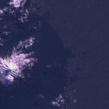
  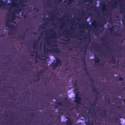 
  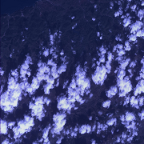
  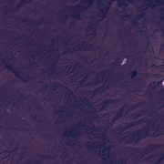
  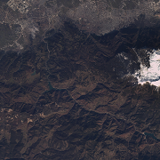
</p>

<b>Ground Truth</b>
<p float="left">
  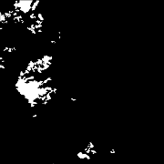
  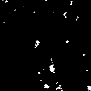 
  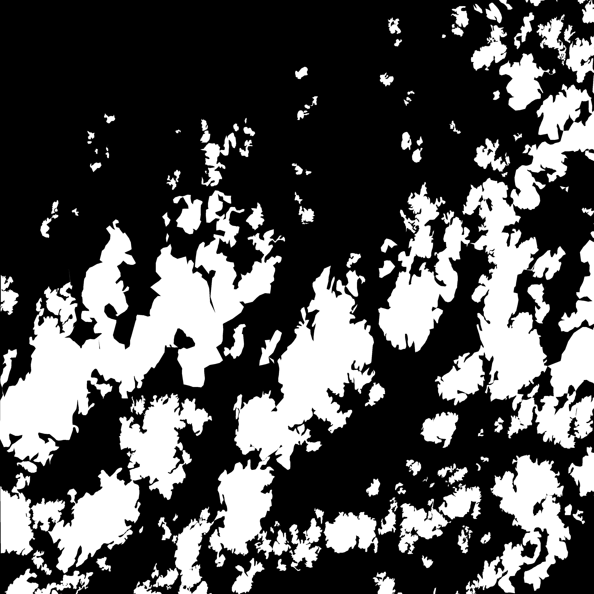
  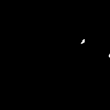
  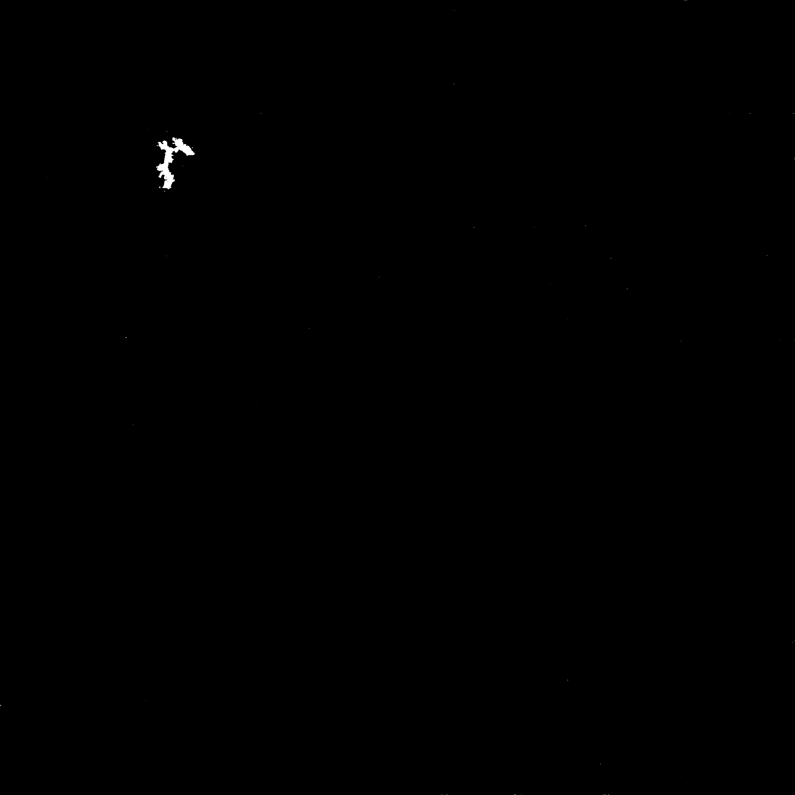
</p>

<b>DPN+VGG-19 (Ours)</b>
<p float="left">
  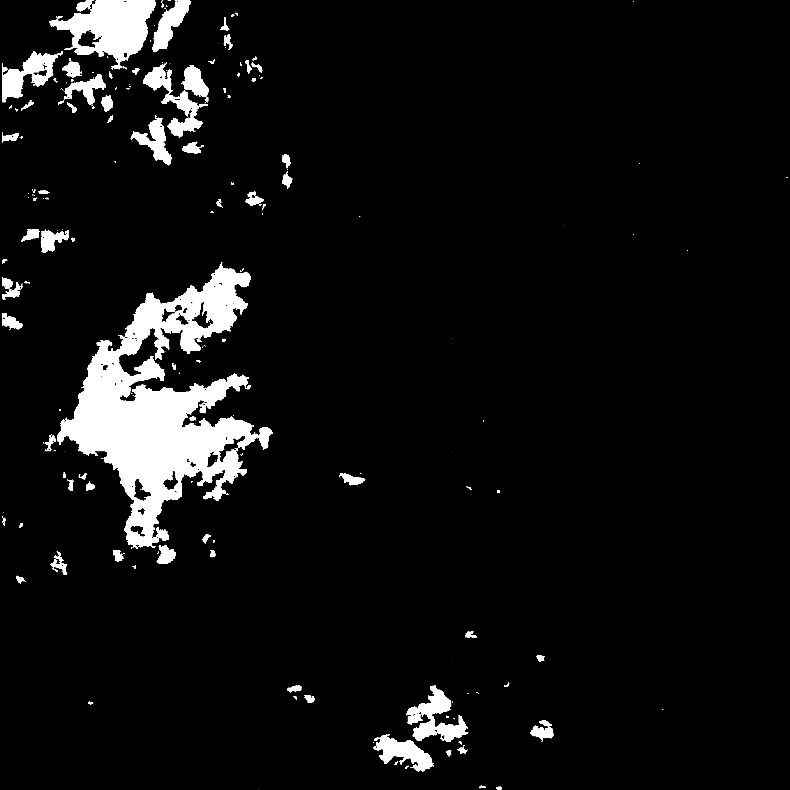
  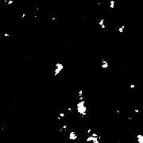 
  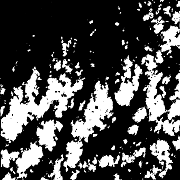
  
  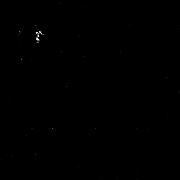
</p>

<b>DPN</b>
<p float="left">
  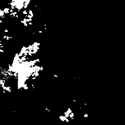
  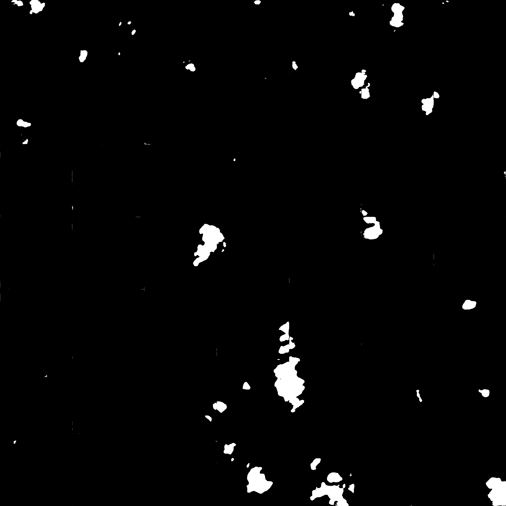 
  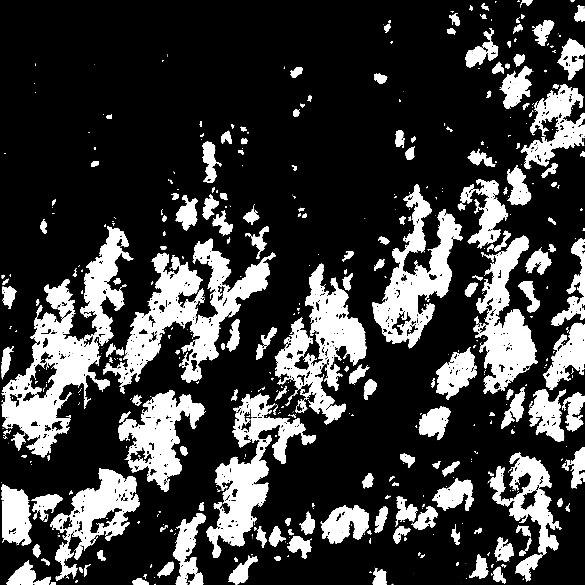
  
  
</p>

<b>SP+CNN</b>
<p float="left">
  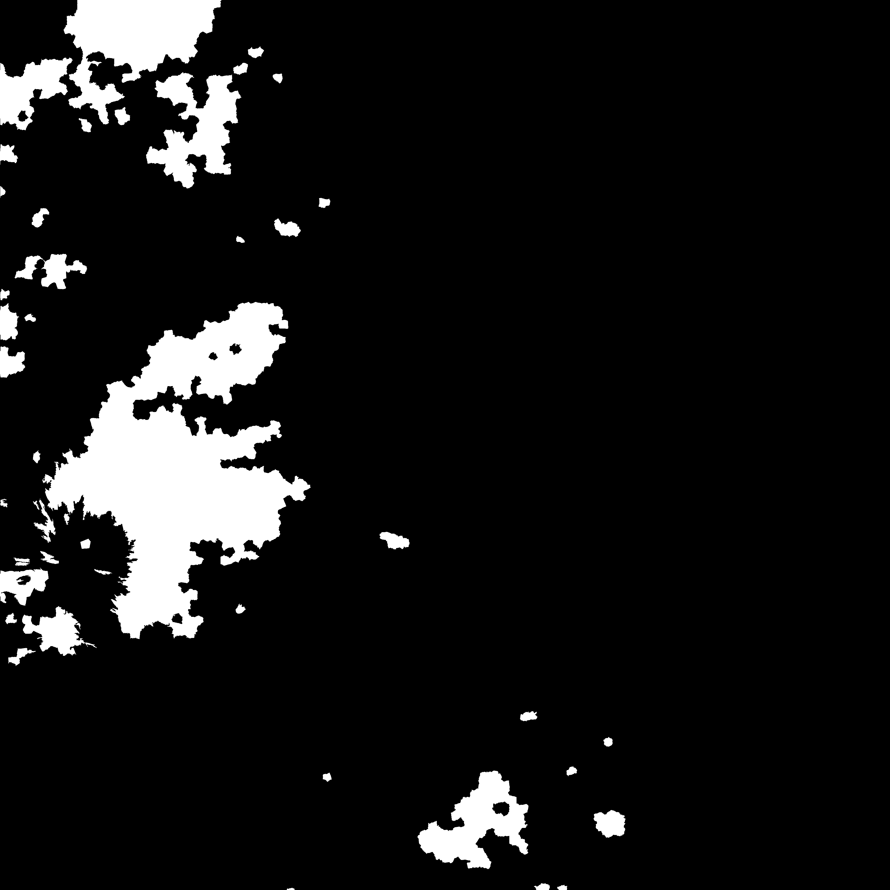
  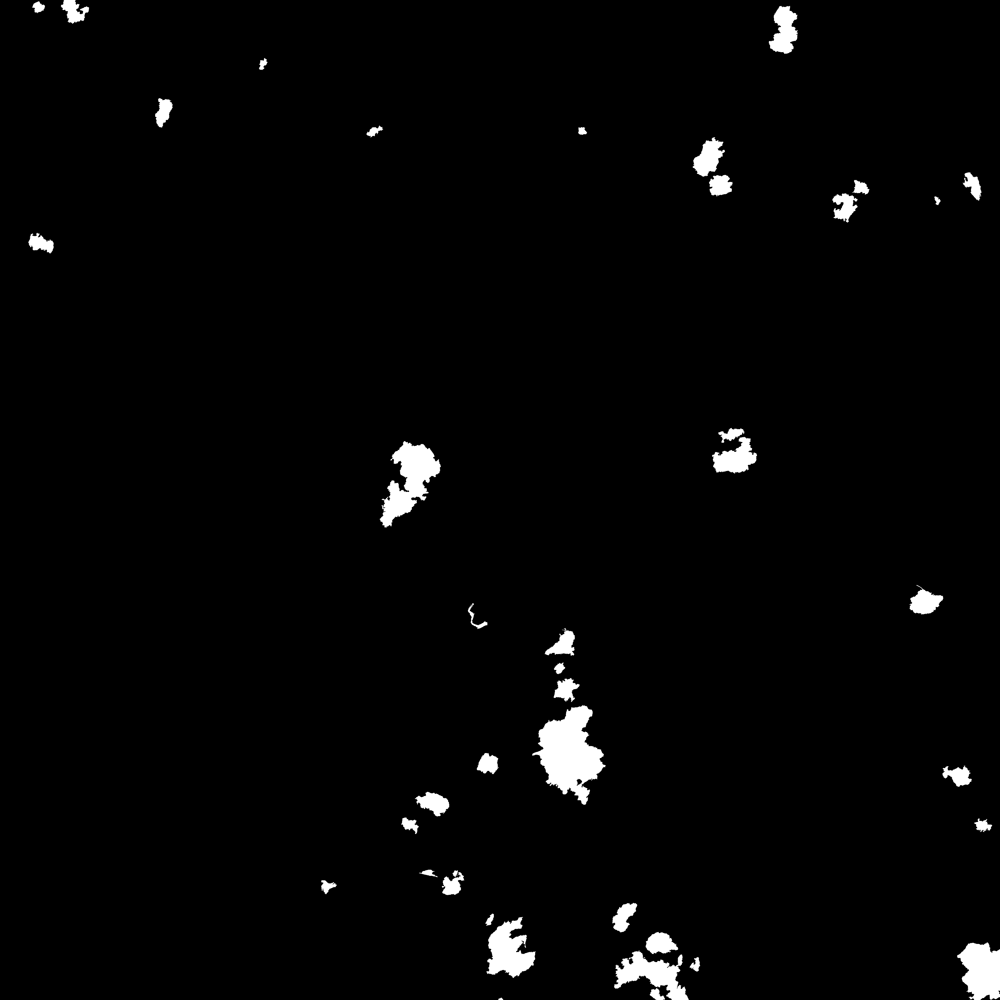 
  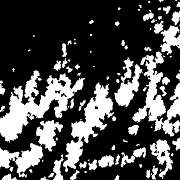
  
  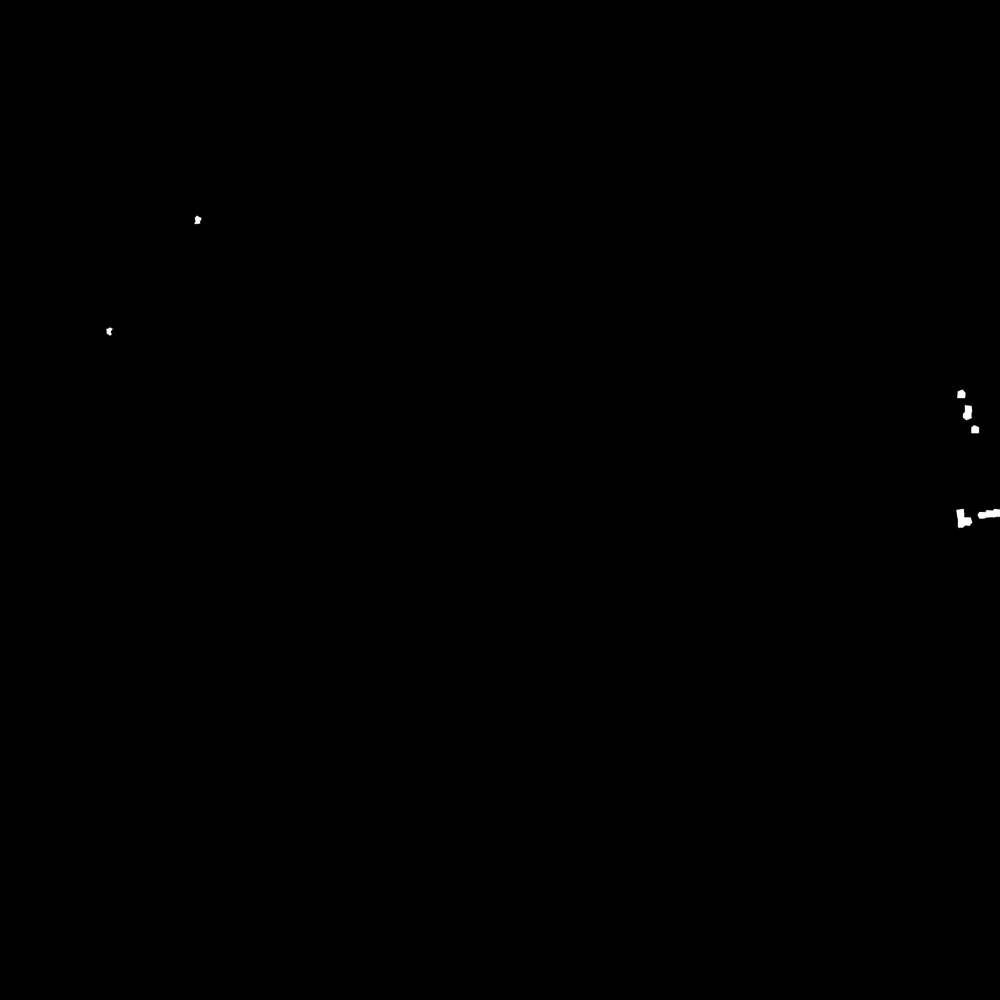
</p>

## References

Please cite the following paper:

[1] Savas Ozkan, Mehmet Efendioglu and Caner Demirpolat, Cloud Detection From RGB Color Remote Sensing Images With Deep Pyramid Networks, arXiv:1708.07335:
```
@article{ozkan18cloud,
  title={Cloud Detection From RGB Color Remote Sensing Images With Deep Pyramid Networks},
  author={Ozkan, Savas and Efendioglu, Mehmet and Demirpolat, Caner},
  journal={arXiv preprint arXiv:1801.08706},
  year={2018},
}
```
